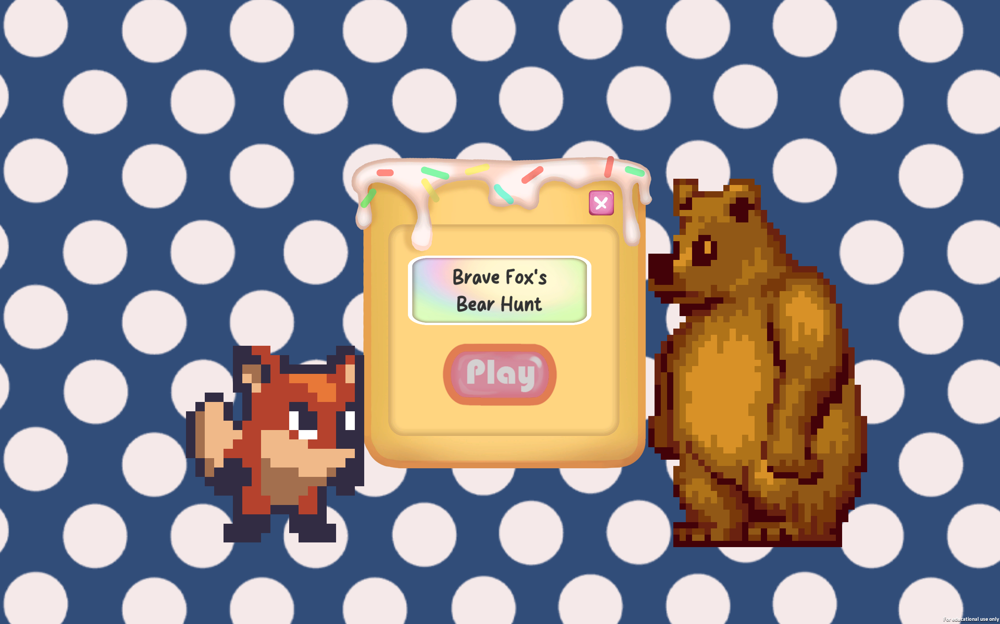
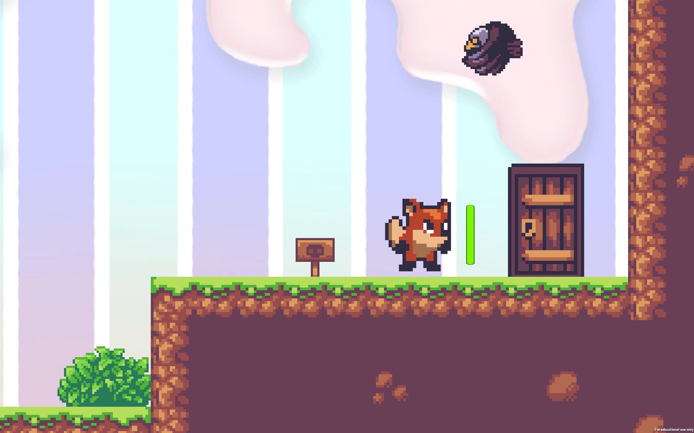
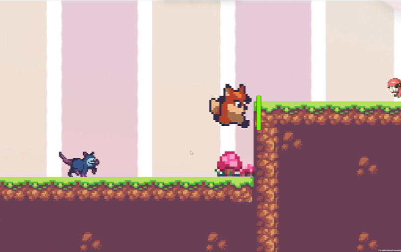
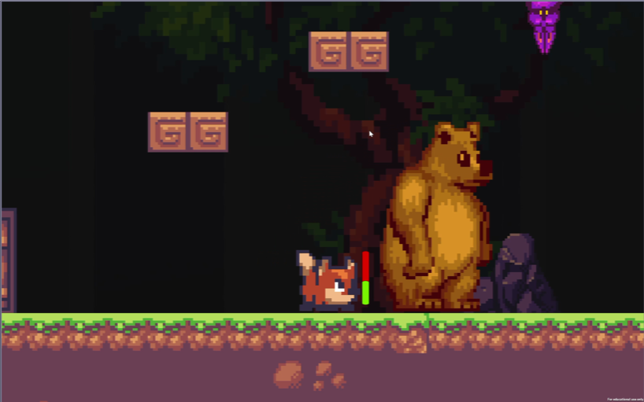
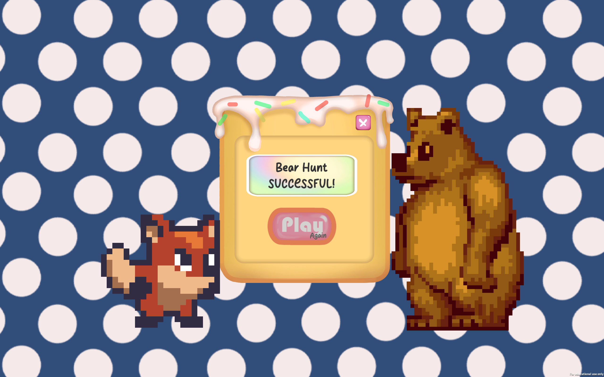

# BraveFox

## Gameplay
- Use arrow keys to move, and the spacebar to jump.

## Game Scene
### Game Start

### Easy Level

### Medium Level

### Hard Level

### Game Over

## Build & Source Code
- Demonstration Video: https://youtu.be/rE0mhi8fU4w
- WebGL Version Available (PC): https://yobisaboy.itch.io/brave-fox
- Game Download: https://github.com/yobisaboy/BraveFox
- Unity Project: https://github.com/yoyohohoh/comp305assignment1

## Contact
- Tel: +1 (647) 637-0831
- Email: hoyiuyiuyoyo@gmail.com
- LinkedIn: https://www.linkedin.com/in/yoyoho
- Portfolio: https://yobisaboy.github.io/Portfolio

